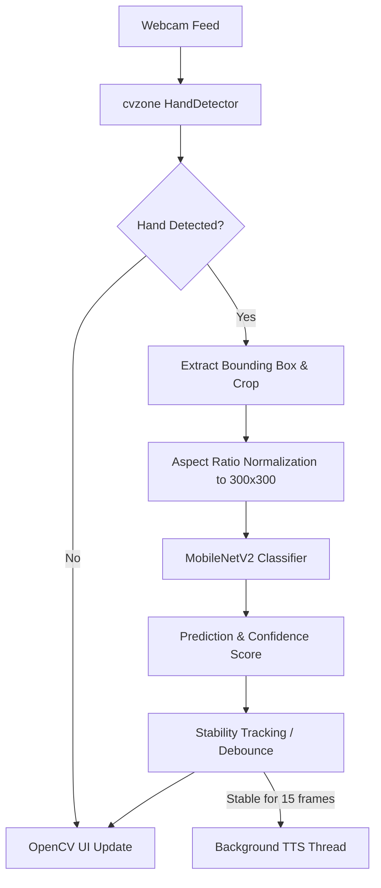
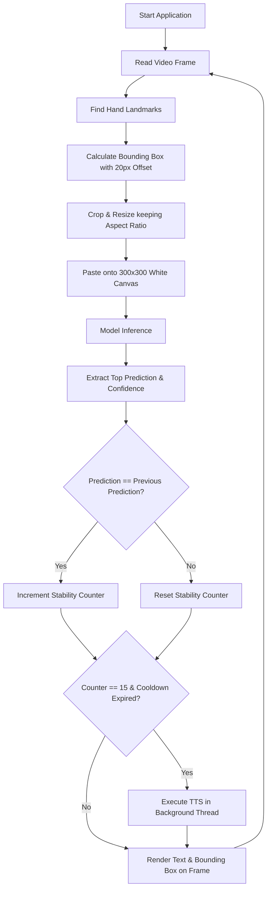

# Real-Time Indian Sign Language (ISL) Detection System

## 1. Problem Statement
**What real-world problem is being solved?**
Communication barriers exist between the deaf and hard-of-hearing community and those who do not understand sign language. 

**Who experiences the problem?**
Individuals who rely on Indian Sign Language (ISL) for daily communication face challenges when interacting with individuals who do not know ISL.

**What is difficult with existing approaches?**
Existing solutions often require specialized hardware (like depth cameras or sensor gloves) or rely on cloud-based processing which introduces latency and privacy concerns. 

**What limitations exist?**
Many computer vision models for gesture recognition struggle with real-time performance on consumer-grade hardware or suffer from accuracy degradation due to lighting changes, background noise, or hand movement blurring.

**Why does this project need to exist?**
This project provides a lightweight, real-time ISL translation tool that runs entirely locally on consumer hardware (specifically optimized for Apple Silicon). By translating gestures to text and speech instantly, it facilitates seamless two-way communication without requiring expensive external hardware.


## 2. 🔥 New: Dual-Mode Hybrid Architecture
This project features a highly advanced **Dual-Mode UI**, allowing it to scale from custom vocabulary words to the entire ISL alphabet seamlessly in real-time.

- **Words Mode (8 Classes):** Uses a custom-built dataset for dynamic conversational words (e.g., *Hello, Please, Thank you*). It utilizes a novel **Aspect-Ratio-Preserving White Canvas Normalization** technique to completely eliminate background noise, achieving 93.75% K-Fold cross-validation accuracy.
- **Alphabets Mode (35 Classes):** Integrates a massive **42,000+ image open-source Kaggle dataset** (`prathumarikeri/indian-sign-language-isl`) for complete A-Z and 1-9 recognition. It automatically scales to detect both hands (merged bounding boxes) to correctly interpret two-handed ISL alphabets.

**You can switch between these two modes instantly in real-time by pressing the `SPACEBAR` during live inference!**

## 2.1 Motivation
This project was developed to democratize access to sign language translation technology. Research in computer vision often prioritizes model accuracy over inference speed and edge-device compatibility. This project addresses the practical need for a system that balances high accuracy with low-latency inference, enabling real-time Text-to-Speech (TTS) feedback that feels natural in a conversational setting.

## 3. Proposed Solution
This system detects hands in a video feed, processes the cropped hand images to a standardized format, and passes them through a deep learning model to predict the corresponding ISL sign. The prediction is then converted into audio feedback.

```text
Input (Webcam Frame)
   ↓
Preprocessing (MediaPipe Hand Tracking & Bounding Box Crop)
   ↓
Core Processing (Aspect Ratio Normalization on White Canvas)
   ↓
Model (MobileNetV2 Transfer Learning)
   ↓
Decision (Softmax Prediction + Confidence Thresholding)
   ↓
Output (On-Screen Text & macOS 'say' TTS)
```

## 4. System Architecture

- **Webcam Feed**: Standard RGB input via OpenCV.
- **cvzone HandDetector**: Wraps Google MediaPipe to locate hand landmarks and generate a bounding box.
- **Aspect Ratio Normalization**: The cropped hand is resized to fit a 300x300 canvas while maintaining its aspect ratio. Missing space is filled with a white background.
- **MobileNetV2 Classifier**: A fine-tuned MobileNetV2 model classifies the processed image into one of 8 classes.
- **Stability Tracking**: Ensures a gesture is held for a set duration before triggering audio to prevent erratic TTS spam.
- **Background TTS Thread**: Executes the native macOS `say` command asynchronously.

## 5. Complete Workflow


## 6. Methodology

### 6.1 Data Collection
- **Input**: Raw webcam frames.
- **Processing**: The user holds a specific ISL sign. The script (`datacollection.py`) isolates the hand, normalizes it to a 300x300 white canvas, and saves it to a class-specific folder when the user presses 's'.
- **Technology**: OpenCV, `cvzone` (MediaPipe).
- **Reason**: To create a consistent, normalized dataset focused purely on hand gestures, removing background noise which confuses the model.

### 6.2 Data Preprocessing
- **Processing**: Normalizes pixel values to `[0, 1]` using `tf.keras.layers.Rescaling(1.0 / 255)`.
- **Reason**: Neural networks converge faster and more stably when input values are small and constrained.

### 6.3 Data Augmentation
- **Processing**: Random horizontal flips, rotation (10%), zoom (10%), and translation (10%).
- **Reason**: Artificially expands the dataset and forces the model to learn invariant features, preventing overfitting to the specific angles present in the training set.

### 6.4 Model Development & Training
- **Processing**: Transfer learning using MobileNetV2. Phase 1 trains only a custom dense classification head. Phase 2 unfreezes the top 30 layers of the base model for fine-tuning.
- **Technology**: TensorFlow/Keras.
- **Reason**: MobileNetV2 is highly optimized for CPU/Edge device inference. Two-phase training prevents the randomized weights of the new dense layers from destroying the pre-trained ImageNet weights through massive gradient updates.

### 6.5 Inference & Output Generation
- **Processing**: The trained model classifies frames in real-time. If a class is detected consistently for 15 frames, a background thread is spawned to run the `say` command.
- **Reason**: Background threading ensures the video feed does not freeze while the OS synthesizes and plays the audio.

## 7. AI / ML Details

Because this project uses a **Dual-Mode Architecture**, there are two parallel models working together:

### 7.1 Word Recognition Model (8 Classes)
- **Model Architecture**: MobileNetV2 (base) + GlobalAveragePooling2D + Dropout(0.3) + Dense(128, ReLU) + Dropout(0.2) + Dense(8, Softmax)
- **Input Size**: 224x224 (Aspect-Ratio Preserved on 300x300 White Canvas).
- **Optimizer**: `tf.keras.optimizers.legacy.Adam` (Optimized for Apple Silicon)
- **Learning Rate**: 1e-3 (Phase 1), 1e-4 (Phase 2)
- **Epochs**: 30 (Phase 1), 20 (Phase 2)
- **Batch Size**: 16
- **Callbacks**: EarlyStopping (patience=5), ReduceLROnPlateau (factor=0.5, patience=3)

### 7.2 Alphabet Recognition Model (Kaggle - 35 Classes)
- **Model Architecture**: MobileNetV2 (base) + GlobalAveragePooling2D + Dropout(0.3) + Dense(256, ReLU) + Dropout(0.2) + Dense(35, Softmax)
- **Input Size**: 224x224 (Raw Dual-Hand Bounding Box Crop).
- **Optimizer**: `tf.keras.optimizers.legacy.Adam` (Optimized for Apple Silicon)
- **Learning Rate**: 1e-3 (Phase 1), 1e-4 (Phase 2)
- **Epochs**: 5 (Phase 1), 5 (Phase 2)
- **Batch Size**: 32
- **Callbacks**: EarlyStopping (patience=3), ReduceLROnPlateau (factor=0.5, patience=2)

**Hardware for Both**: CPU/M-series XNNPACK acceleration.

## 8. Datasets

This project utilizes two completely different datasets to power the Dual-Mode architecture:

### 8.1 Custom ISL Gesture Dataset (Words Mode)
- **Source**: Collected locally via webcam (`datacollection.py`)
- **Number of Samples**: ~1,745 images
- **Classes** (8): Hello, Home, I love you, No, Okay, Please, Thank you, Yes.
- **Data Format**: 300x300 RGB `.jpg` images with pure white backgrounds.
- **Collection methodology**: Real-time localized hand cropping using MediaPipe bounding boxes.

### 8.2 Kaggle ISL Dataset (Alphabets Mode)
- **Source**: [Prathum Arikeri on Kaggle](https://www.kaggle.com/datasets/prathumarikeri/indian-sign-language-isl) (`kagglehub`)
- **Number of Samples**: 42,000+ images
- **Classes** (35): Alphabets A-Z, Numbers 1-9.
- **Data Format**: 128x128 RGB `.jpg` images (resized to 224x224 during training).
- **Characteristics**: Features diverse lighting, backgrounds, and varying hand sizes, requiring the system to dynamically switch to a 2-hand MediaPipe tracking mode (`maxHands=2`) for certain alphabetical gestures.

## 9. Algorithms

**Algorithm: Aspect Ratio Preserving Crop & Canvas Normalization**
- **Purpose**: To resize arbitrarily shaped rectangular hand bounding boxes into a square (300x300) without stretching or squishing the hand.
- **Input**: Cropped hand image (`imgCrop`)
- **Process**:
  1. Calculate aspect ratio: `h / w`
  2. If `aspectRatio > 1` (Taller than wide):
     - Scale height to 300.
     - Scale width proportionally (`k * w`).
     - Calculate gap needed to center horizontally on a 300x300 white canvas.
     - Paste resized image in the center.
  3. Else (Wider than tall):
     - Scale width to 300.
     - Scale height proportionally (`k * h`).
     - Calculate gap needed to center vertically on a 300x300 white canvas.
     - Paste resized image in the center.
- **Output**: 300x300 `imgWhite` normalized image.

**Algorithm: Debounced Text-to-Speech (TTS)**
- **Purpose**: Prevent audio spam and stuttering when model confidence fluctuates rapidly between frames.
- **Input**: Current frame `index` prediction, `labels` list.
- **Process**:
  1. If `index == prev_index`, increment `stable_count`.
  2. Else, reset `stable_count = 1` and update `prev_index`.
  3. If `stable_count == 15` AND (sign changed OR `time.time() - last_speak_time > 3` seconds):
     - Spawn daemon thread: `subprocess.run(["say", text])`
     - Update `last_spoken` and `last_speak_time`.
- **Output**: Audio synthesis without UI blocking.

## 10. Experimental Setup
- **Hardware**: Apple Silicon (M-series) Mac
- **Operating System**: macOS
- **Python Version**: 3.9+ (Virtual Environment)
- **Framework Versions**: TensorFlow (using legacy Keras via `tf-keras`), OpenCV (`opencv-python`), `cvzone`, `mediapipe==0.10.14` (specific version to prevent Metal API crashes on Mac).

## 11. Experiments Required for Research Evaluation
Rigorous experimentation is required before academic publication. The following experiments have NOT yet been performed and must be executed:
- **K-Fold Cross Validation**: The current model uses a static random seed (42) for an 80/20 split. K-fold validation is required to ensure the model hasn't overfitted to this specific split.
- **Independent Test Set Evaluation**: A completely isolated test set (preferably with different users, lighting conditions, and backgrounds) must be collected and evaluated.
- **Inference Latency Benchmarking**: Measure the exact ms/frame latency of the MediaPipe tracking + MobileNetV2 inference pipeline on CPU vs GPU.

## 12. Evaluation Metrics
Appropriate metrics to evaluate this classification system:
- **Accuracy**: Overall correctness of the model.
- **Precision, Recall, F1-score**: To analyze class imbalance and identify which specific signs are most frequently confused (e.g., "Hello" vs "Okay").
- **Confusion Matrix**: Visual representation of misclassifications.
- **Inference Latency (FPS)**: Critical for real-time viability.

## 13. Results
The model currently outputs the following metrics during training/validation:

| Metric | Value |
|--------|-------|
| Training Accuracy | ~97.1% - 99.8% |
| Validation Accuracy | ~96.3% - 100% |

*Note: These results are based on the internal validation split. True real-world performance requires the isolated test set experiments mentioned above.*

## 14. Baseline Comparison
For a research paper, this system should be compared against:
1. **Raw CNN**: A custom CNN architecture built from scratch without transfer learning.
2. **MediaPipe Landmark Heuristics**: Using raw landmark coordinates (angles between joints) fed into an SVM or Random Forest, bypassing image-based CNN classification entirely.
3. **Comparison Metrics**: Model Size (MB), Inference Latency (FPS), and Classification Accuracy (F1-score).

## 15. Limitations
- **Background Dependence**: The system assumes the MediaPipe hand detector flawlessly tracks the hand. If tracking fails, the model fails.
- **Hardware Lock**: The TTS relies on the macOS `say` command, limiting the code's cross-platform deployability to Windows/Linux without code modification.
- **Limited Vocabulary**: Supports only 8 static ISL signs.
- **Static Gestures Only**: Does not utilize temporal data (LSTMs/Transformers), meaning it cannot detect gestures that require movement across time.

## 16. Future Work
### Short-Term Improvements
- Refactor the TTS module to use `pyttsx3` for cross-platform support.
- Implement a confusion matrix generation script to analyze test performance.
### Research Extensions
- Introduce Recurrent Neural Networks (RNN/LSTM) to process sequences of frames for dynamic gesture recognition.
- Compare XNNPACK CPU inference vs CoreML GPU inference latency.
### Production Improvements
- Package the application into a standalone executable using PyInstaller.
- Add a GUI to select the camera index and adjust prediction confidence thresholds dynamically.

## 17. Research Contributions
The project implements:
- A real-time, low-latency pipeline integrating Google MediaPipe hand tracking with a fine-tuned MobileNetV2 classification head.
- A deterministic aspect-ratio preserving normalization algorithm that improves CNN accuracy by standardizing hand shapes regardless of user distance from the camera.
- A background-threaded, debounced audio synthesis module that translates continuous visual classifications into natural auditory feedback without blocking the main event loop.

## 18. Reproducibility
To run this project:
```bash
# 1. Clone the repository and navigate to the folder
git clone <repository_url>
cd Sign-Language-detection-main

# 2. Setup Virtual Environment
python -m venv .venv
source .venv/bin/activate

# 3. Install dependencies
pip install opencv-python cvzone mediapipe==0.10.14 tf-keras scipy pyttsx3 kagglehub

# 4. Train the Custom Word Model (8 Classes)
TF_USE_LEGACY_KERAS=1 python train.py

# 5. Train the Kaggle Alphabet Model (35 Classes, 42,000 images)
TF_USE_LEGACY_KERAS=1 python train_kaggle.py

# 6. Run the Combined Real-Time Inference (Dual-Mode)
TF_USE_LEGACY_KERAS=1 python test_combined.py
# (Press SPACEBAR to switch between Words and Alphabets!)
```

## 19. Project Structure
```text
Sign-Language-detection-main/
├── Data/                 # Contains captured images categorized by class folders
│   ├── Hello/
│   ├── Home/
│   ├── I love you/
│   ├── No/
│   ├── Okay/
│   ├── Please/
│   ├── Thank you/
│   └── Yes/
├── Model/                # Generated model artifacts
│   ├── keras_model.h5    # Compiled model weights and architecture
│   └── labels.txt        # Dynamically generated list of classes
├── datacollection.py     # Script for generating training data via webcam
├── train.py              # Script for training the MobileNetV2 model
├── test.py               # Main inference script with OpenCV UI and TTS
└── README.md             # This documentation
```
*(Note: `hand_landmarker.task` is dynamically downloaded/used by MediaPipe).*

---

# Research Paper Preparation

### Current Research Readiness
| Area | Status | Required Action |
|------|--------|-----------------|
| Problem Definition | Complete | None |
| Literature Review | Missing | Review papers on ASL/ISL detection using MediaPipe/MobileNetV2. |
| Dataset | Partial | Needs a documented, isolated test set. |
| Methodology | Complete | None |
| Experiments | Missing | Execute isolated test set evaluation & latency benchmarks. |
| Baselines | Missing | Implement SVM on landmarks or a basic CNN for comparison. |
| Results | Partial | Only train/val accuracy is available. Needs precision/recall/F1. |
| Reproducibility | Complete | None |

## Experiments Required Before Publication

1. **Test Set Evaluation**
   - **Objective**: Determine true generalization accuracy.
   - **Method**: Collect 50 images per class from a different user not present in the training set. Evaluate using an isolated evaluation script.
   - **Metrics**: Accuracy, Precision, Recall, F1-Score, Confusion Matrix.
   - **Supports**: "Results" and "Discussion" sections.

2. **Inference Latency Benchmark**
   - **Objective**: Prove the "real-time" and "lightweight" claims.
   - **Method**: Log time differences before and after the full `test.py` loop (tracking + inference + TTS check) for 1000 frames.
   - **Metrics**: Average Frames Per Second (FPS), Average Milliseconds per Frame.
   - **Supports**: "Performance Evaluation" section.

3. **Baseline Comparison**
   - **Objective**: Prove MobileNetV2 transfer learning is necessary.
   - **Method**: Extract raw `(x, y)` coordinates from MediaPipe, flatten them, and train a Scikit-Learn SVM. Compare accuracy and latency against the MobileNetV2 image pipeline.
   - **Metrics**: Accuracy, FPS.
   - **Supports**: "Methodology Justification" and "Results" sections.
